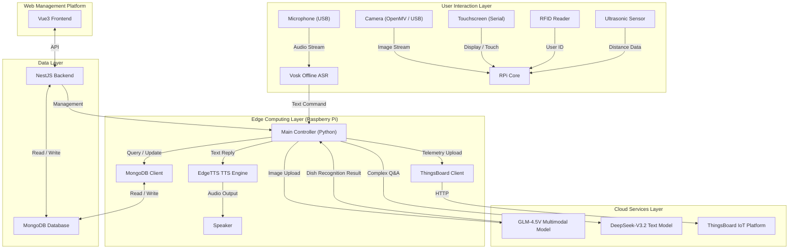

English | [简体中文](README_zh-hans.md)

# ginseng_menu_ai

Intelligent Canteen Multimodal Dish Recommendation System (Raspberry Pi + AI + Web Dashboard)

## Introduction

**ginseng_menu_ai** is an intelligent canteen assistant system based on **Raspberry Pi** with a web management backend. The system uses multimodal capabilities such as voice input, image recognition, touch operation, and RFID user identification to provide users with personalized dish recommendations and food information queries.

The system combines the **GLM-4.5V Multimodal Model** and **DeepSeek-V3.2 Text Model** to automatically learn user preferences and continuously optimize recommendation results. It also works with MongoDB to store dish data and user preference data.

The project includes a **Web Platform (Vue3 + Nest.js)** that allows canteen administrators to manage dishes, view data analysis, and enables users to view today's dishes and personalized recommendations online.

## 📺 Project Demo

[](https://www.bilibili.com/video/BV1Hw24BfExM)

> Click the badge or link above to watch the demo video: [https://www.bilibili.com/video/BV1Hw24BfExM](https://www.bilibili.com/video/BV1Hw24BfExM)

---

## Project Structure

This project mainly includes the following three core modules:

### 1. `src_raspi_app` (Raspberry Pi Client)
A Python application running on Raspberry Pi, responsible for direct user interaction.
-   **Core Functions**:
    -   **Voice Interaction**: Collects voice through USB microphone, supports natural language Q&A.
    -   **Visual Recognition**: Integrates camera (OpenMV/USB Camera) to recognize dishes on plates.
    -   **Touch Display**: Drives Nextion serial screen or HDMI screen to display recommendation information and menus.
    -   **Sensor Integration**:
        -   **Ultrasonic Sensor**: Detects user proximity and automatically wakes the system.
        -   **RFID/NFC**: Reads user meal cards to load personalized preferences.
-   **Entry File**: `src_raspi_app/main.py`
-   **Main Components**:
    - `hardware/` - Hardware interface modules (audio, display, sensors, etc.)
    - `services/` - AI service interfaces and business logic
    - `database/` - Database connection and operations
    - `utils/` - Utility functions
    - `pipeline/` - Data processing pipeline

### 2. `src_web` (Web Management and User Platform)
A web-based management backend and user frontend for data management and visualization.
-   **Frontend (Vue3 + Vite + Ant Design Vue)**:
    -   Administrator Dashboard: View system status and sensor data statistics.
    -   Dish Management: Add, delete, modify, and query canteen dish information.
    -   Data Analysis: User preference trends, popular dish statistics.
-   **Backend (Nest.js + Mongoose)**:
    -   Provides RESTful API interfaces.
    -   Connects to MongoDB database, serving both the Raspberry Pi and Web frontend.
-   **Main Components**:
    - `src/modules/` - Contains dish management, user management, data analysis modules
    - `src/models/` - Data model definitions

### 3. `single_module_test` (Hardware Test Module)
Contains feasibility test code and driver scripts for individual hardware modules.
-   Used to independently test whether hardware such as microphones, cameras, ultrasonic sensors, and RFID readers are working properly.
-   Includes `PCR532_nfcreader.py` (NFC test), `mic_transcription.py` (voice test), etc.

---

## Features

### 🔊 Voice Recognition
Collects user voice input through USB microphone, supporting natural language Q&A, such as:
* "What low-fat dishes are available today?"
* "Can you check what's on my plate?"

### 🎥 Dish Recognition
Takes photos of plates through the camera, calls multimodal models to recognize dishes, and returns:
* Dish name
* Category (meat/vegetarian/light, etc.)
* Calorie estimate
* Recommendation for pairing suggestions

### 🖥️ Touch Display
Displays various information:
* Dish analysis
* Recommended combinations
* User preferences
* Today's menu

### 📶 Smart Wake-up
* **Ultrasonic Sensing**: Automatically wakes up when user is near, enters standby mode when user leaves, energy-saving and environmentally friendly.

### 📡 RFID User Identification
Uses meal cards to read user ID, supporting:
* User mode (loads preferences)
* Guest mode (anonymous recommendations)

### 📊 Web Management Backend
* **Real-time Monitoring**: View device online status and running data.
* **Data Insights**: Visualize canteen operation data.

### ☁️ ThingsBoard IoT Platform Integration
The system integrates with **ThingsBoard** for device telemetry and monitoring:
* **Real-time Telemetry**: Uploads sensor data such as ultrasonic distance, camera status, microphone status, RFID card reading events.
* **Remote Control**: Supports issuing commands through ThingsBoard to control Raspberry Pi behavior (such as restarting services, updating configurations).
* **Data Visualization**: Real-time viewing of canteen traffic and equipment health status on ThingsBoard dashboard.

### 🔒 Localized AI Capabilities
To improve response speed and protect privacy, lightweight models are deployed at the edge (Raspberry Pi):
* **Offline Voice Recognition (Vosk)**:
    * Uses the **Vosk** engine for local speech to text (STT).
    * Processes wake words and basic commands without internet connection, very low response delay, and protects user voice privacy.
* **Edge Voice Synthesis (EdgeTTS)**:
    * Uses **EdgeTTS** to generate high-quality, natural voice feedback.
    * More natural than traditional offline TTS, while avoiding the high cost and latency of cloud-based TTS.

---

## Installation and Running

### 1. Environment Preparation

#### System Requirements
- **Raspberry Pi**: 4B or higher, 4GB+ RAM
- **Python**: 3.8 or higher
- **Node.js**: 18 or higher
- **MongoDB**: 4.4 or higher
- **NPM/Yarn**: For frontend and backend dependency management

#### Configure Environment Variables
First create and configure the environment variable file:
```bash
cp .env.example .env
```
Then edit the `.env` file to fill in the relevant API keys and database configuration:
```
DEEPSEEK_API_KEY=your_deepseek_api_key
ZHIPUAI_API_KEY=your_zhipuai_api_key
DATABASE_URL=your_mongodb_connection_string
```

### 2. Raspberry Pi Client (`src_raspi_app`)

Ensure that hardware such as microphones, cameras, and displays are properly connected.

```bash
# Enter directory
cd src_raspi_app

# Install dependencies (virtual environment recommended)
pip install -r requirements.txt

# Run main program
python main.py
```

#### Configuration File Description

Project configuration files are located in the `src_raspi_app/config/` directory:

*   **`model.yaml`**: Configures AI model parameters and API Key.
    *   `vision_model`: Zhipu GLM-4.5V configuration.
    *   `text_model`: DeepSeek-V3.2 configuration.
    *   `preference_system`: Personalized recommendation weight settings.
*   **`hardware.yaml`**: Hardware parameter configuration.
    *   `ultrasonic`: Ultrasonic wake-up distance (`wake_distance_cm`) and trigger duration.
*   **`database.yaml`**: Database connection parameters.

#### Hardware List

| Hardware Name | Model/Spec | Connection | Notes |
| :--- | :--- | :--- | :--- |
| **Main Board** | Raspberry Pi 4B | - | 4GB+ RAM recommended |
| **Display** | Nextion Serial Screen | USB/TTL (`/dev/ttyUSB1`) | 115200 baud rate |
| **Camera** | OpenMV H7 Plus | USB | For dish recognition |
| **Microphone** | USB Omnidirectional Mic | USB | Voice capture |
| **Ultrasonic** | HC-SR04 | GPIO | Distance detection |
| **Reader** | PN532 NFC/RFID | I2C/SPI/UART (`/dev/ttyUSB0`) | ID card reading |

### 3. Web Platform (`src_web`)

#### Backend

```bash
cd src_web/backend

# Install dependencies
npm install

# Start development server
npm run start:dev
```

#### Frontend

```bash
cd src_web/frontend

# Install dependencies
npm install

# Start development server
npm run dev
```

---

## System Architecture



---

## Development Guide

### Project Structure Details

```
ginseng-menu-ai/
├── .env.example          # Environment variable example file
├── requirements.txt      # Project dependencies (mainly for Raspberry Pi client)
├── README.md            # Project documentation
├── README.en.md         # English project documentation
├── LICENSE              # License file
├── docs/                # Project documentation
│   ├── hardware/        # Hardware-related documentation
│   └── local_models_archive/ # Local model documentation
├── local_models/        # Local model files
│   └── vosk-model-small-en-us-0.15/ # Vosk voice recognition model
├── single_module_test/  # Hardware module standalone test code
│   ├── edgetts_test.py  # EdgeTTS test
│   ├── mic_transcription.py # Microphone transcription test
│   ├── PCR532_nfcreader.py # NFC reader test
│   ├── ultrasonic_ranging.py # Ultrasonic ranging test
│   └── OpenMv_camera/   # OpenMV camera test code
├── src_raspi_app/       # Raspberry Pi client source code
│   ├── main.py          # Main program entry
│   ├── config/          # Configuration files
│   ├── database/        # Database related
│   ├── hardware/        # Hardware interface implementation
│   ├── pipeline/        # Data processing pipeline
│   ├── services/        # Service layer (AI interfaces, etc.)
│   └── utils/           # Utility functions
└── src_web/             # Web platform source code
    ├── backend/         # Backend source code (Nest.js)
    └── frontend/        # Frontend source code (Vue3)
```

### Contribution Guidelines

1. Fork the project
2. Create a feature branch (`git checkout -b feature/AmazingFeature`)
3. Commit changes (`git commit -m 'Add some AmazingFeature'`)
4. Push to the branch (`git push origin feature/AmazingFeature`)
5. Open a Pull Request

### Directory Description

*   **`src_raspi_app`**: Raspberry Pi client core code, written in Python
    *   `hardware/`: Modules for interacting with various hardware devices
    *   `services/`: Modules for interacting with AI models and external services
    *   `database/`: MongoDB database operation related code
    *   `utils/`: Various utility functions
    *   `pipeline/`: Data processing pipeline related code

*   **`src_web/backend`**: Web backend, using Nest.js framework
    *   `src/modules/`: Implementation of different functional modules
    *   `src/models/`: Database model definitions
    *   `src/controllers/`: API controllers
    *   `src/services/`: Business logic services

*   **`src_web/frontend`**: Web frontend, using Vue3 framework
    *   `src/components/`: Reusable Vue components
    *   `src/views/`: Page view components
    *   `src/api/`: API request wrappers

---

## License

This project is licensed under the MIT License - see the [LICENSE](LICENSE) file for details.