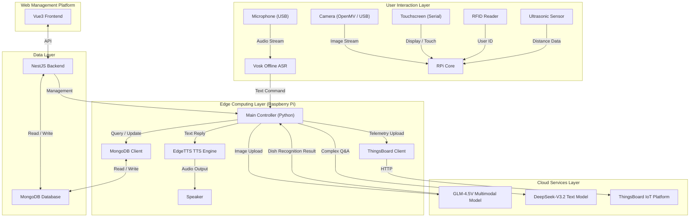

[English](README.md) | 简体中文

# ginseng_menu_ai

智能食堂多模态菜品推荐系统（Raspberry Pi + AI + Web Dashboard）

## 简介

**ginseng_menu_ai** 是一个基于 **树莓派** 的智能食堂助手系统，结合了 Web 管理后台。系统通过语音输入、图像识别、触控操作和 RFID 用户识别等多模态能力，为用户提供个性化菜品推荐与菜品信息查询。

系统结合 **GLM-4.5V 多模态模型** 和 **DeepSeek-V3.2 文本模型**，自动学习用户偏好并持续优化推荐效果。同时配合 MongoDB 存储菜品数据与用户偏好数据。

项目包含一个 **Web 端平台（Vue3 + Nest.js）**，让食堂管理员管理菜品、查看数据分析，用户也可以在线查看今日菜品与个性化推荐。

## 📺 项目演示

[](https://www.bilibili.com/video/BV1Hw24BfExM)

> 点击上方徽章或链接观看演示视频：[https://www.bilibili.com/video/BV1Hw24BfExM](https://www.bilibili.com/video/BV1Hw24BfExM)

---

## 项目结构

本项目主要包含以下三个核心模块：

### 1. `src_raspi_app` (树莓派客户端)
运行在树莓派上的 Python 应用程序，负责与用户进行直接交互。
-   **核心功能**：
    -   **语音交互**：通过 USB 麦克风采集语音，支持自然语言问答。
    -   **视觉识别**：集成摄像头（OpenMV/USB Camera）识别餐盘菜品。
    -   **触控显示**：驱动 Nextion 串口屏或 HDMI 屏幕，显示推荐信息和菜单。
    -   **传感器集成**：
        -   **超声波传感器**：检测用户靠近，自动唤醒系统。
        -   **RFID/NFC**：读取用户饭卡，加载个性化偏好。
-   **入口文件**：`src_raspi_app/main.py`
-   **主要组件**：
    - `hardware/` - 硬件接口模块（音频、显示、传感器等）
    - `services/` - AI服务接口和业务逻辑
    - `database/` - 数据库连接和操作
    - `utils/` - 工具函数
    - `pipeline/` - 数据处理流程

### 2. `src_web` (Web 管理与用户平台)
基于 Web 的管理后台和用户前端，用于数据管理和可视化。
-   **Frontend (Vue3 + Vite + Ant Design Vue)**：
    -   管理员仪表盘：查看系统运行状态、传感器数据统计。
    -   菜品管理：增删改查食堂菜品信息。
    -   数据分析：用户偏好趋势、热销菜品统计。
-   **Backend (Nest.js + Mongoose)**：
    -   提供 RESTful API 接口。
    -   连接 MongoDB 数据库，服务于树莓派和 Web 前端。
-   **主要组件**：
    - `src/modules/` - 包含菜品管理、用户管理、数据分析等模块
    - `src/models/` - 数据模型定义

### 3. `single_module_test` (硬件测试模块)
包含对单个硬件模块的可行性测试代码和驱动脚本。
-   用于独立测试麦克风、摄像头、超声波传感器、RFID 读卡器等硬件是否正常工作。
-   包含 `PCR532_nfcreader.py` (NFC测试), `mic_transcription.py` (语音测试) 等。

---

## 功能特性

### 🔊 语音识别
通过 USB 麦克风采集用户语音输入，支持自然语言问答，例如：
* “今天有什么低脂的菜？”
* “帮我看看我餐盘里是什么？”

### 🎥 菜品识别
通过摄像头拍摄餐盘，调用多模态模型识别菜品，并返回：
* 菜品名称
* 分类（荤/素/清淡等）
* 热量估计
* 推荐搭配建议

### 🖥️ 触控显示
显示各类信息：
* 菜品分析
* 推荐组合
* 用户偏好
* 今日菜单

### 📶 智能唤醒
* **超声波感应**：用户靠近自动唤醒，离开自动进入待机模式，节能环保。

### 📡 RFID 用户识别
使用饭卡读取用户 ID，支持：
* 用户模式（加载偏好）
* 访客模式（匿名推荐）

### 📊 Web 管理后台
* **实时监控**：查看设备在线状态和运行数据。
* **数据洞察**：可视化展示食堂运营数据。

### ☁️ ThingsBoard 物联网平台集成
系统集成了 **ThingsBoard** 进行设备遥测与监控：
* **实时遥测**：上传超声波距离、摄像头状态、麦克风状态、RFID 读卡事件等传感器数据。
* **远程控制**：支持通过 ThingsBoard 下发指令控制树莓派行为（如重启服务、更新配置）。
* **数据可视化**：在 ThingsBoard 仪表板上实时查看食堂人流与设备健康状况。

### 🔒 本地化 AI 能力
为了提升响应速度并保护隐私，系统在边缘端（树莓派）部署了轻量级模型：
* **离线语音识别 (Vosk)**：
    * 采用 **Vosk** 引擎进行本地语音转文字 (STT)。
    * 无需联网即可处理唤醒词和基础指令，响应延迟极低，且保护用户语音隐私。
* **边缘语音合成 (EdgeTTS)**：
    * 使用 **EdgeTTS** 生成高质量、自然的语音反馈。
    * 相比传统离线 TTS 更加自然，同时避免了云端 TTS 的高昂成本和延迟。

---

## 安装与运行

### 1. 环境准备

#### 环境要求
- **Raspberry Pi**: 4B 或更高版本，4GB+ 内存
- **Python**: 3.8 或更高版本
- **Node.js**: 18 或更高版本
- **MongoDB**: 4.4 或更高版本
- **NPM/Yarn**: 用于前端和后端依赖管理

#### 配置环境变量
首先创建并配置环境变量文件：
```bash
cp .env.example .env
```
然后编辑 `.env` 文件，填入相关 API 密钥和数据库配置：
```
DEEPSEEK_API_KEY=your_deepseek_api_key
ZHIPUAI_API_KEY=your_zhipuai_api_key
DATABASE_URL=your_mongodb_connection_string
```

### 2. 树莓派客户端 (`src_raspi_app`)

确保已连接好麦克风、摄像头、显示屏等硬件。

```bash
# 进入目录
cd src_raspi_app

# 安装依赖 (建议使用虚拟环境)
pip install -r requirements.txt

# 运行主程序
python main.py
```

#### 配置文件说明

项目配置文件位于 `src_raspi_app/config/` 目录下：

*   **`model.yaml`**: 配置 AI 模型参数与 API Key。
    *   `vision_model`: 智谱 GLM-4.5V 配置。
    *   `text_model`: DeepSeek-V3.2 配置。
    *   `preference_system`: 个性化推荐权重设置。
*   **`hardware.yaml`**: 硬件参数配置。
    *   `ultrasonic`: 超声波唤醒距离 (`wake_distance_cm`) 与触发时长。
*   **`database.yaml`**: 数据库连接参数。

#### 硬件清单

| 硬件名称 | 型号/规格 | 连接方式 | 备注 |
| :--- | :--- | :--- | :--- |
| **主控板** | Raspberry Pi 4B | USB | 4GB+ 内存推荐 |
| **显示屏** | Nextion 串口屏 | USB/TTL (`/dev/ttyUSB1`) | 115200 波特率 |
| **摄像头** | OpenMV H7 Plus | USB | 用于菜品识别 |
| **麦克风** | USB 全向麦克风 | USB | 语音采集 |
| **超声波** | HC-SR04 | GPIO | 距离检测 |
| **读卡器** | PN532 NFC/RFID | USB/TTL (`/dev/ttyUSB0`) | 饭卡读取 |

### 3. Web 平台 (`src_web`)

#### 后端 (Backend)

```bash
cd src_web/backend

# 安装依赖
npm install

# 启动开发服务器
npm run start:dev
```

#### 前端 (Frontend)

```bash
cd src_web/frontend

# 安装依赖
npm install

# 启动开发服务器
npm run dev
```

---

## 系统架构



---

## 开发指南

### 项目结构详解

```
ginseng-menu-ai/
├── .env.example          # 环境变量示例文件
├── requirements.txt      # 项目总体依赖（主要是树莓派端）
├── README.md            # 项目说明文档
├── LICENSE              # 许可证文件
├── docs/                # 项目文档
│   ├── hardware/        # 硬件相关文档
│   └── local_models_archive/ # 本地模型相关文档
├── local_models/        # 本地模型文件
│   └── vosk-model-small-en-us-0.15/ # Vosk 语音识别模型
├── single_module_test/  # 硬件模块单独测试代码
│   ├── edgetts_test.py  # EdgeTTS 测试
│   ├── mic_transcription.py # 麦克风转录测试
│   ├── PCR532_nfcreader.py # NFC 读卡器测试
│   ├── ultrasonic_ranging.py # 超声波测距测试
│   └── OpenMv_camera/   # OpenMV 摄像头测试代码
├── src_raspi_app/       # 树莓派客户端源码
│   ├── main.py          # 主程序入口
│   ├── config/          # 配置文件
│   ├── database/        # 数据库相关
│   ├── hardware/        # 硬件接口实现
│   ├── pipeline/        # 数据处理流程
│   ├── services/        # 服务层（AI接口等）
│   └── utils/           # 工具函数
└── src_web/             # Web平台源码
    ├── backend/         # 后端源码 (Nest.js)
    └── frontend/        # 前端源码 (Vue3)
```

### 贡献指南

1. Fork 项目
2. 创建功能分支 (`git checkout -b feature/AmazingFeature`)
3. 提交更改 (`git commit -m 'Add some AmazingFeature'`)
4. 推送到分支 (`git push origin feature/AmazingFeature`)
5. 开启 Pull Request

### 目录说明

*   **`src_raspi_app`**: 树莓派客户端核心代码，使用 Python 编写
    *   `hardware/`: 与各种硬件设备交互的模块
    *   `services/`: 与 AI 模型和外部服务交互的模块
    *   `database/`: MongoDB 数据库操作相关代码
    *   `utils/`: 各种工具函数
    *   `pipeline/`: 数据处理流程相关代码

*   **`src_web/backend`**: Web 后端，使用 Nest.js 框架
    *   `src/modules/`: 不同功能模块的实现
    *   `src/models/`: 数据库模型定义
    *   `src/controllers/`: API 控制器
    *   `src/services/`: 业务逻辑服务

*   **`src_web/frontend`**: Web 前端，使用 Vue3 框架
    *   `src/components/`: 可复用的 Vue 组件
    *   `src/views/`: 页面视图组件
    *   `src/api/`: API 请求封装

---

## 许可证

本项目采用 MIT 许可证 - 详见 [LICENSE](LICENSE) 文件。